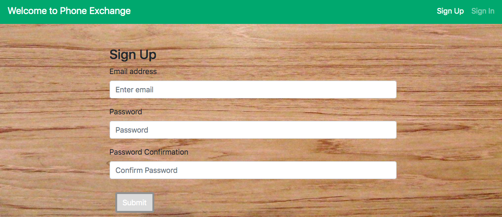
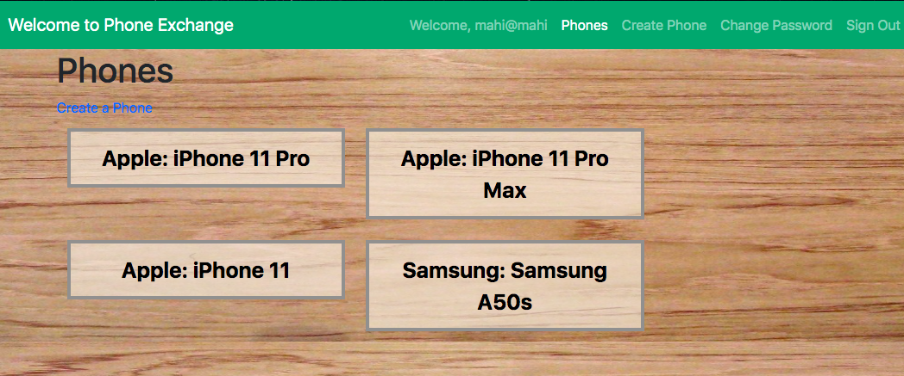
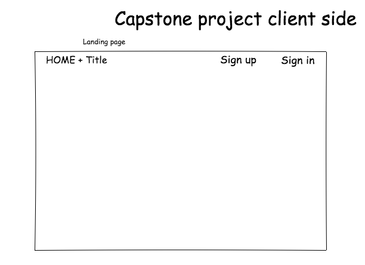
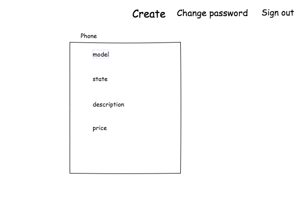
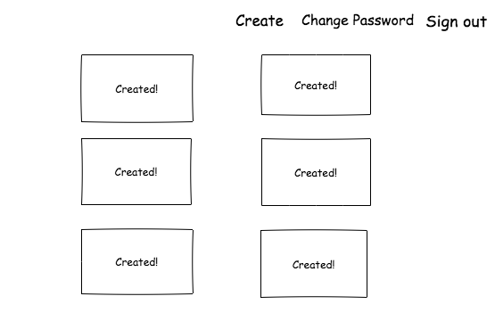
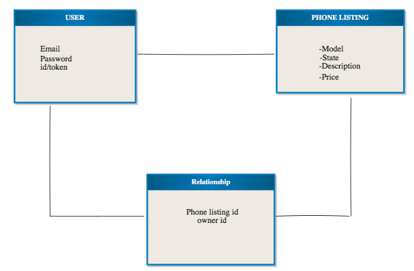

Phone: E-commerce React App

This is a single page E-commerce application that allows users to exchange electronics products with other users. Once the user registered with an email adress and Password, they will have an access to upload the choice of their electronics products with a listing of the items' name, model, state, description and price. The user can create many resources and be able to see all saved items, update and delete. Users can only mangae thier own products and do not have an access to make a change on others' users products.

## Link
- [Live site](https://mk1366.github.io/Capstone-Client/#/)
- [Api Repository](https://github.com/mk1366/React-api)
- [Live Api](https://boiling-lake-07501.herokuapp.com/)

## Techonologies
- React
- Express
- Mongoose
- MongoDB
- Bootstraps
- CSS
- Git
- Curl Script
- HTML5
- JSX
- Node.js
- psotman

## App Preview

## <h3>Landing page</h3>

"

## User Stories

- As a user, I want to be able to sign-up successfully.
- As user, I want to be able to sign-in successfully.
- As a user, I want to be able to change my password.
- As a user, I want to be able to add an items/phones to my cart
- As a user, I want to update the content of my saved items in the cart.
- As a user, I want to be able to delete an item I have added to my cart.
- As a user I want to be able to see all the items I have added to my cart.

## ERD + Wireframe

## [License](LICENSE)

1. All content is licensed under a CC­BY­NC­SA 4.0 license.
1. All software code is licensed under GNU GPLv3. For commercial use or
    alternative licensing, please contact legal@ga.co.
